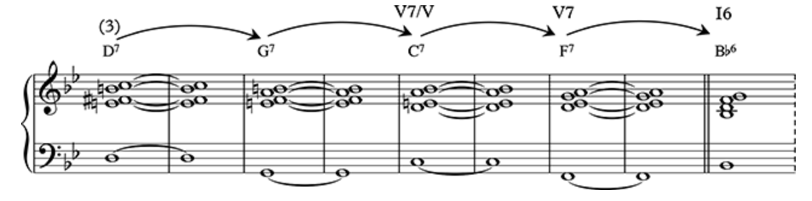
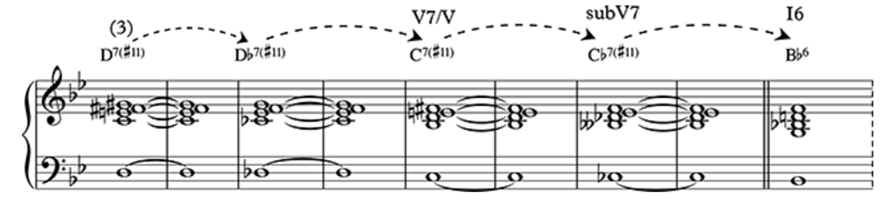
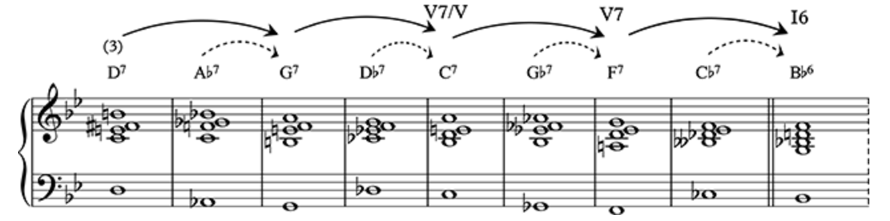
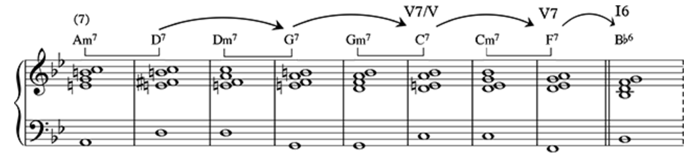

# Level 02

## Extended Dominant Series

A series of **three or more** dominant chords that start on a **strong** harmonic stress point, and resolve, one to the next, by descending perfect-5th root motion.

It is a backward extension of the V7/V - V - I progression. For example, the progression below is an extended dominant series that resolves to the tonic chord Cmaj7.

F#7 - B7 - E7 - A7 - D7 - G7 - Cmaj7

The chord scale is Mixolydian, hence we can use 9, 13 as tension.

> 1, T9, 3, S4, 5, T13, b7, 1

In addition, the extended dominant series can be used to:
- Resolve to different diatonic chords
- Indefinite Ending

## Deceptive Resolution of Secondary Dominant

There are three types of deceptive resolutions of secondary dominants:

- Resolve perfect-5th down to a different chord quality.
- Resolve up by step to a diatonic chord.
- Resolve down by half step to a triad, maj7, or 7th chord.

## Substitute Dominants

In major-key harmony, substitute dominants (SubV) is the substitution of the dominant chord V7. SubV is the diminished 5th degree above the V7. In the key of C, the SubV of G7 is Db7.

V7 and SubV share the same tritone. Let's review the G7 and its SubV Db7.

- G7: G, B, D, F. B, F form a tritone.
- Db7: Db, F, Ab, Cb. F, Cb form a tritone.

The 3rd of G7 is the 7th of Db7. The 7th of G7 is the 3rd of Db7.

### Usage of SubV

We can use SubV to resolve to the tonic chord.

Similarly, we can also use SubV to replace secondary dominants.

| Secondary Dominant | Substitute Dominant | Interpolated? |
|--------------------|---------------------|---------------|
| V7/II              | SubV/II             | No            |
| V7/III             | SubV/III            | Yes           |
| V7/IV              | SubV/IV             | No            |
| V7/V               | SubV/V              | No            |
| V7/VI              | SubV/VI             | Yes           |

### Related II Chord and SubV

| Related II | SubV           | Target Chord |
|------------|----------------|--------------|
| Ab-7       | Db7 subV7   | Cmaj7        |
| Bb-7       | Eb7 subV7/II| D-7          |
| N/A        | F7 subV7/III| E-7          |
| Db-7       | Gb7 subV7/IV| Fmaj7        |
| Eb-7       | Ab7 subV7/V | G7           |
| N/A        | Bb7 subV7/VI| A-7          |

### Chromatically Related II Chord and SubV

| Chromatically Related II | SubV           | Target Chord |
|--------------------------|----------------|--------------|
| D-7                      | Db7 subV7   | Cmaj7        |
| E-7                      | Eb7 subV7/II| D-7          |
| F#-7                     | F7 subV7/III| E-7          |
| G-7                      | Gb7 subV7/IV| Fmaj7        |
| A-7                      | Ab7 subV7/V | G7           |
| B7                       | Bb7 subV7/VI| A-7          |

### Related II Chord of SubV Moving to V7

| Related II of SubV | Dominants       | Target Chord |
|--------------------|-----------------|--------------|
| Ab-7               | G7 V7        | Cmaj7        |
| Bb-7               | A7 V7/II     | D-7          |
| N/A                | B7 V7/III    | E-7          |
| Db-7               | C7 V7/IV     | Fmaj7        |
| Eb-7               | D7 V7/V      | G7           |
| N/A                | E7 V7/VI     | A-7          |

### Chord Scale of SubV

Start with V7, Mixolydian scale

> 1, T9, 3, S4, 5, T13, b7, 1

Adding b9, b13, #9, and lowering the 5th, we get the altered dominant scale

> 1, Tb9, T#9, 3, b5, Tb13, b7, 1

Reorder the scale from b5, the root of the substitute dominant, we get the Lydian b7 scale.

> 1, T9, 3, T#11, 5, T13, b7, 1

In addition, for substitute dominants that resolve to a target chord that has a major 3rd (i.e. I, IV, and V7), we can use Lydian b7 (#9).

> 1, T#9, 3, T#11, 5, T13, b7, 1

### Extended Dominants Series Using Extended SubVs

We use Gershwin's tune "I Got Rhythm" as an example. The original rhythm changes bridge uses an extended dominant series.

There are three ways to add extended SubVs:

**Replace Dominants with SubV**

**Interpolate SubVs**

**Interpolate Related II**

