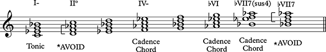
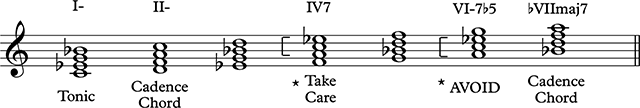
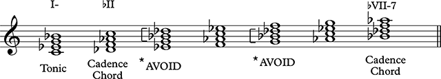

# Level 3

## Modal Composition

### Minor Modal Melody Writing Guideline

* Reference the tonic or tonic triad frequently

* Use the characteristic note sparingly to embellish

* Use strong melodic cadences: Aeolian and Dorian: 2-1, ♭7-1, 2-♭7-1, ♭7-2-1, 5-1. Phrygian: ♭2-1, ♭7-1, ♭2-♭7-1, ♭7-♭2-1, 5-1  

### Harmonizing Minor Modal Melody

Modal progressions are constructed by alternating the tonic chord with modal cadence chords. More temporal weight should be given to the tonic chord if possible.

Modal cadence chords are those chords that contain the characteristic note.

Chords that contain the diatonic tritone are to be avoided or used with care as cadence chords in order to avoid tonicizing the relative major.

The relative tonic should only be used as an approach chord on a weak metrical stress.

Other diatonic chords in the mode may be used as approach chords to cadence chords.

**Aeolian Harmony**

**Dorian Harmony**

**Phrygian Harmony**

### Major Modal Melody Writing Guideline

* The characteristic note of Ionian is 4, Lydian is ♯4, and Mixolydian is ♭7.

* Reference the tonic or tonic triad frequently

* Use the characteristic note sparingly to embellish

* Use strong melodic cadences: Mixolydian: 2-1, ♭7-1, 2-♭7-1, ♭7-2-1, 5-1, Lydian: 2-1, 7-1, 2-7-1, 7-2-1, 5-1

### Harmonizing Major Modal Melody

Modal progressions are constructed by alternating the tonic chord with modal cadence chords. More temporal weight should be given to the tonic chord if possible.

Modal cadence chords are those chords that contain the characteristic note.

Chords that contain the diatonic tritone are to be avoided or used with care as cadence chords in order to avoid tonicizing the relative major.

The relative tonic should only be used as an approach chord on a weak metrical stress.

Other diatonic chords in the mode may be used as approach chords to cadence chords.

**Mixolydian Harmony**

**Lydian Harmony**

