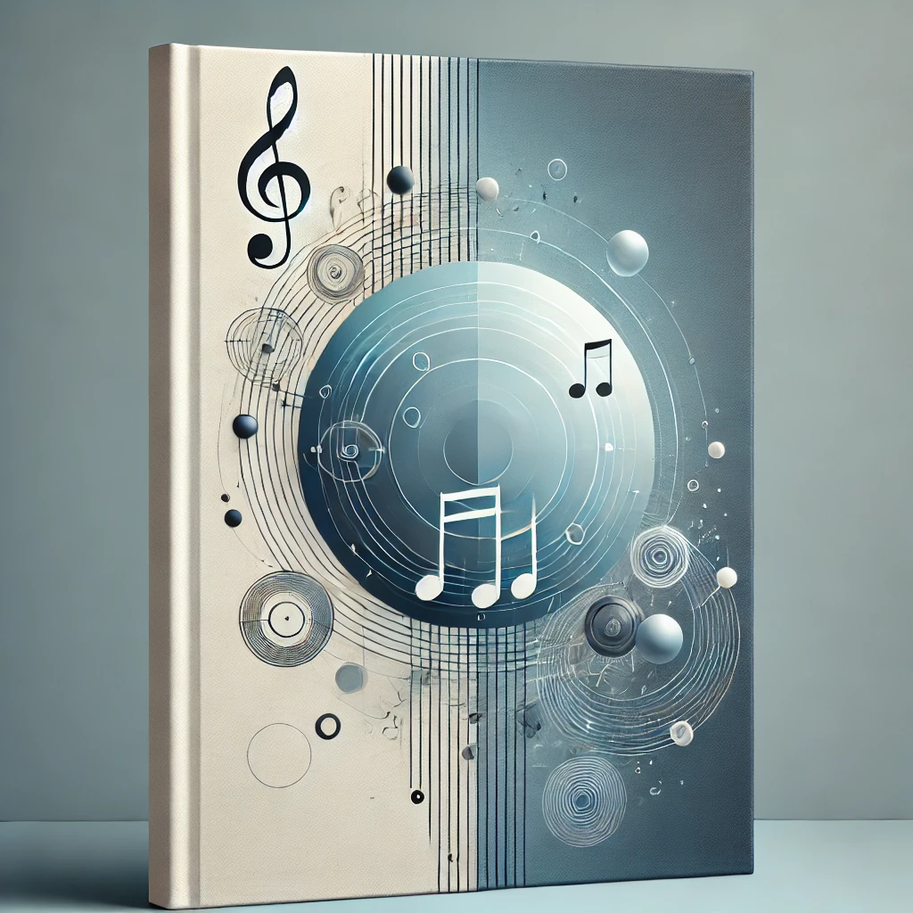

  

# Table of Contents
- [Level 01](#level-01)
  - [Major Key Secondary Dominant](#major-key-secondary-dominant)
    - [The Formula](#the-formula)
    - [Example in Key of C](#example-in-key-of-c)
  - [Major Key Secondary Dominant Chord Scale](#major-key-secondary-dominant-chord-scale)
    - [The Formula](#the-formula-1)
    - [Example in Key of C](#example-in-key-of-c-1)
  - [Related II Chords](#related-ii-chords)
    - [Example in Key of C](#example-in-key-of-c-2)
  - [Deceptive Resolution of Primary Dominant](#deceptive-resolution-of-primary-dominant)
    - [The Formula](#the-formula-2)
    - [Example in C Major](#example-in-c-major)
  - [Deceptive Resolution of Secondary Dominants](#deceptive-resolution-of-secondary-dominants)
    - [The Formula](#the-formula-3)
    - [Example in C Major](#example-in-c-major-1)
  - [Composite Minor](#composite-minor)
    - [Composite Minor Scale](#composite-minor-scale)
    - [Example in A Minor](#example-in-a-minor)
    - [All 7th Chords from Composite Minor](#all-7th-chords-from-composite-minor)
    - [Harmonic Function in Minor Key](#harmonic-function-in-minor-key)
    - [Line Cliche Examples](#line-cliche-examples)
    - [Secondary Dominants in Minor Key](#secondary-dominants-in-minor-key)
  - [Modal Interchange](#modal-interchange)
    - [Modal Interchange Chords](#modal-interchange-chords)
    - [Deceptive Resolution to Maj7 Modal Interchange Chords](#deceptive-resolution-to-maj7-modal-interchange-chords)
  - [Modulation](#modulation)
  - [Hybrid Chords](#hybrid-chords)
    - [IV Hybrid Chords](#iv-hybrid-chords)
    - [V Hybrid Chords](#v-hybrid-chords)
  - [Guide Tone](#guide-tone)
- [Level 02](#level-02)
  - [Extended Dominant Series](#extended-dominant-series)
  - [Deceptive Resolution of Secondary Dominant](#deceptive-resolution-of-secondary-dominant)